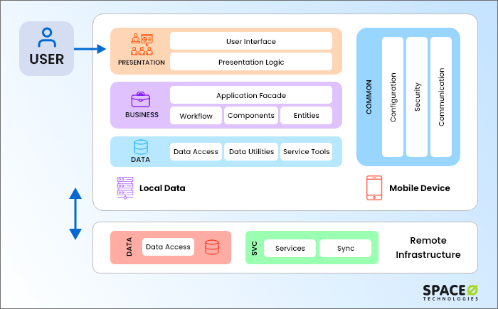

# Application Design and Development
## Rapid Application Development
- RAD software is a agile model that focuses on fast prototyping and quick feedback in app development to ensure speedier delivery and an efficient result.
- App development has 4 phases
  - **Business Modeling:** Defining the requirements
  - **Data Modeling:** Defining the data requirements
  - **Process Modeling:** Prototyping
  - **Testing & Turnover** Receiving feedback and finalizing the software

Several approaches used to speed up the development:
- Drag and drop 
- Function library
- Automatically generate code

### Application Performance
Caching techniques used to reduce cost of serving pages by exploiting commonalities between requests.

### Application Security
- **SQL Injection**
- **Password Leakage**
- **Authentication**
  - Single Factor Authentication
  - Two Factor Authentication

#### Audit Trails
Applications must log actions to audit trail, to detect who carried out an update, or accessed some sensitive data

Audit trails used after the fact to:
- detect security breaches
- repair damage caused by security breach 
- trace who carried out the breach

Audit trails needed at
- Database level, and at
- Application level

# Mobile Apps
## Architecture of a Mobile app
- Typically 3-Tier
  - Presentation
  - Business
  - Data

- Data layer if often split between
  - Local data
  - Remote data
- Need customization for platform
  - Android
  - iOS
  - Windows

## Design Issues
- Determine Device
- Note device resources- memory, power, speed
- Consider bandwidth
- Decide on architecture layers
- select technology
- Define user interface
- Select Navigation 
- Maintain Flow
- 